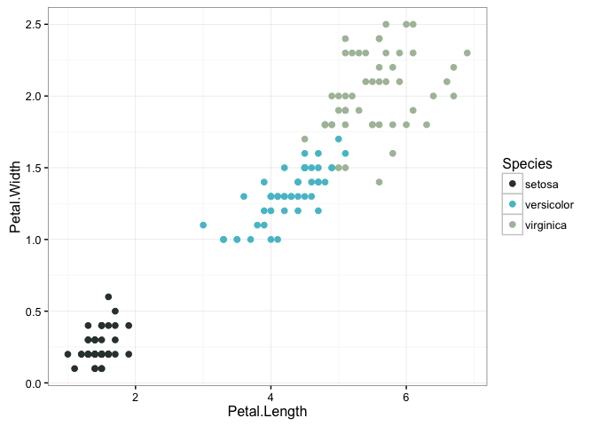
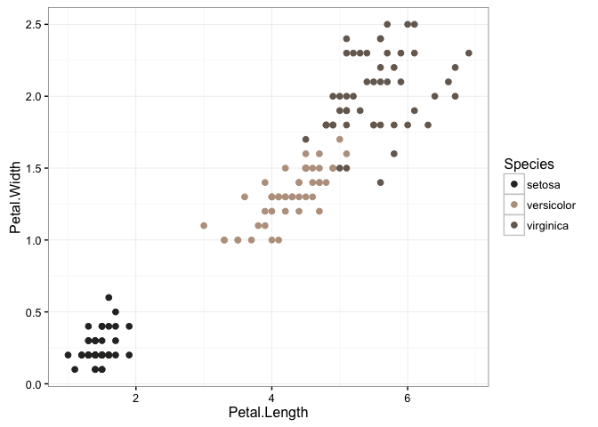

earthtones
================

Geographic color schemes
------------------------

Let's say you wanted a color scheme based on a particular part of the world. For example the grand canyon.

``` r
grand_canyon<-plot_satellite_image_and_pallette(latitude = 36.094994,longitude=-111.837962,zoom=12,number_of_colors=5)
```

    ## Map from URL : http://maps.googleapis.com/maps/api/staticmap?center=36.094994,-111.837962&zoom=12&size=640x640&scale=2&maptype=satellite&language=en-EN&sensor=false


Or maybe you want a color scheme drawn from tropical reefs and lagoons.

``` r
bahamas<-plot_satellite_image_and_pallette(latitude = 24.2,longitude=-77.88,zoom=11,number_of_colors=5)
```

    ## Map from URL : http://maps.googleapis.com/maps/api/staticmap?center=24.2,-77.88&zoom=11&size=640x640&scale=2&maptype=satellite&language=en-EN&sensor=false


Just pick your favorite place in the world, and find out the major colors

``` r
 uluru<-plot_satellite_image_and_pallette(latitude = -25.5,longitude = 131,zoom=10,number_of_colors=5)
```

    ## Map from URL : http://maps.googleapis.com/maps/api/staticmap?center=-25.5,131&zoom=10&size=640x640&scale=2&maptype=satellite&language=en-EN&sensor=false


The function `plot_satellite_image_and_pallette` is good for seeing both the image and the color palette. To actually use the color, it's much easier to use `get_earthtones`. For example:

``` r
library(ggplot2)
bahamas_colors<-get_earthtones(latitude = 24.2,longitude=-77.88,
zoom=11,number_of_colors=3)
```

    ## Map from URL : http://maps.googleapis.com/maps/api/staticmap?center=24.2,-77.88&zoom=11&size=640x640&scale=2&maptype=satellite&language=en-EN&sensor=false

``` r
ggplot(iris,aes(x=Petal.Length,y=Petal.Width,col=Species))+geom_point(size = 2)+
  scale_color_manual(values = bahamas_colors)+theme_bw()
```



or

``` r
grand_canyon<-get_earthtones(latitude = 36.094994,longitude=-111.837962,zoom=12,number_of_colors=3)
```

    ## Map from URL : http://maps.googleapis.com/maps/api/staticmap?center=36.094994,-111.837962&zoom=12&size=640x640&scale=2&maptype=satellite&language=en-EN&sensor=false

``` r
ggplot(iris,aes(x=Petal.Length,y=Petal.Width,col=Species))+geom_point(size = 2)+
  scale_color_manual(values = grand_canyon)+theme_bw()
```



Methods details
---------------

1.  This library gets an image from Google earth which come from different sources depending on the zoom and the particular place.

2.  It then extracts the colors in the image, translates them into a perceptually uniform color space and then runs k-means clustering algorithm to find the major colors for an area

3.  These are then converted back into a R style color pallete.
