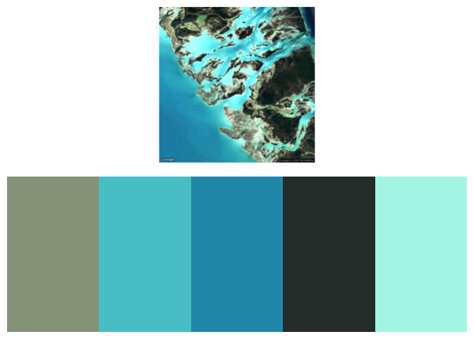
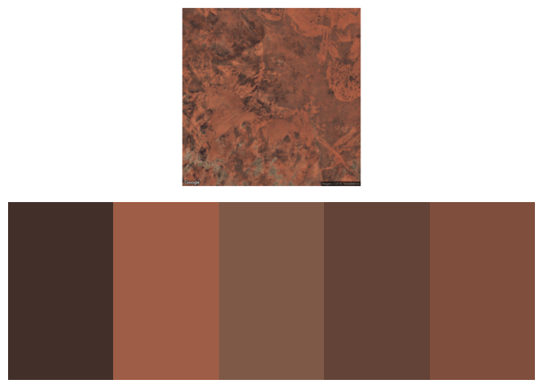
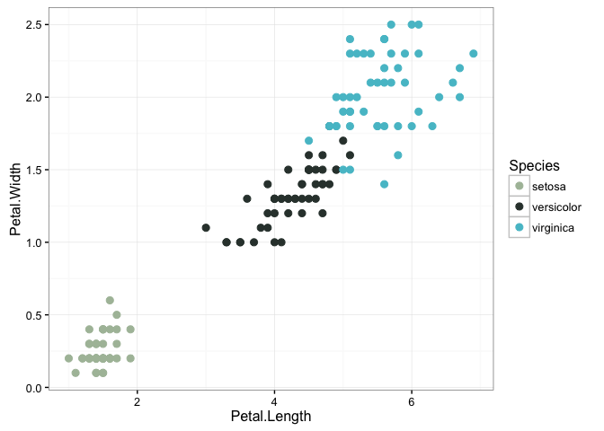
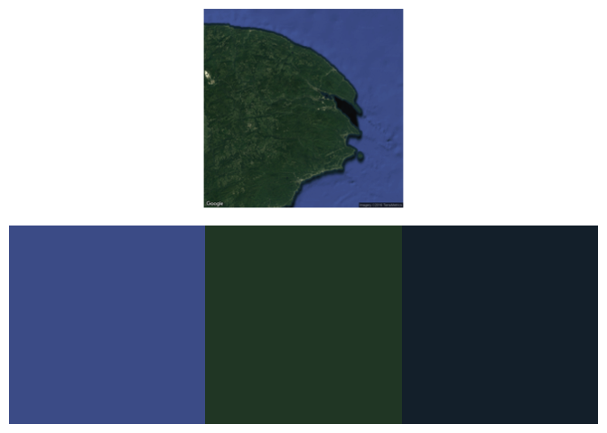
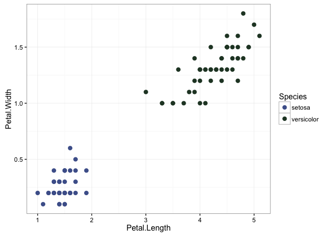
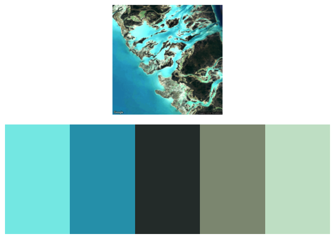
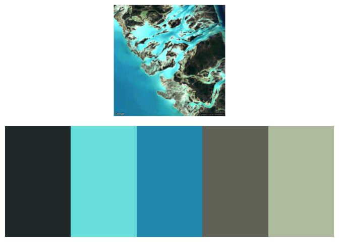

earthtones
================

[](https://travis-ci.org/wcornwell/earthtones) [](https://codecov.io/github/wcornwell/earthtones/)

Here is how to install the package:

``` r
if(!require(devtools)) install.packages("devtools")
devtools::install_github("wcornwell/earthtones")
library("earthtones")
```

Geographic color schemes
------------------------

Let's say you wanted a color scheme based on a particular part of the world. For example here are some colors from the grand canyon.

``` r
get_earthtones(latitude = 36.094994, longitude=-111.837962, 
               zoom=12, number_of_colors=8)
```


`number_of_colors` corresponds to how many colors you want back. The zoom value is passed to `ggmap`--essentially larger values zoom closer to the target lat+long.

Or maybe you want a color scheme drawn from tropical reefs and lagoons.

``` r
get_earthtones(latitude = 24.2, longitude=-77.88, zoom=11, number_of_colors=5)
```



Just pick your favorite place in the world, and find out the major colors

``` r
get_earthtones(latitude = -25.5, longitude = 131, zoom=10, number_of_colors=5)
```



The function `plot_satellite_image_and_pallette` is good for seeing both the image and the color palette. To actually use the color, it's much easier to use `get_earthtones`. For example:

``` r
if(!require(ggplot2)) install.packages("ggplot2")
bahamas_colors <- get_earthtones(latitude = 24.2,
      longitude=-77.88, zoom=11, number_of_colors=3,include.map=FALSE)
ggplot(iris, aes(x=Petal.Length, y=Petal.Width, col=Species))+
  geom_point(size = 2.5)+
  scale_color_manual(values = bahamas_colors)+
  theme_bw()
```



And now Fisher's irises are colored in a Bahama style. However, actually data from two of the three iris speces was collected by a botanist named Edgar Anderson from the [Gaspé Peninsula in Quebec](https://www.jstor.org/stable/2394164?seq=1#page_scan_tab_contents), so it might be better to use a color scheme from there for those two species.

``` r
iris.from.gaspe <- dplyr::filter(iris, Species!="virginica")

get_earthtones(latitude = 48.7709,
  longitude=-64.660939,zoom=9,number_of_colors = 2)
```



``` r
gaspe <- get_earthtones(latitude = 48.7709,
  longitude=-64.660939 ,zoom=9, number_of_colors = 2,include.map=FALSE)
ggplot(iris.from.gaspe, aes(x=Petal.Length, y=Petal.Width,col=Species))+
  geom_point(size = 2)+
  scale_color_manual(values = gaspe)+
  theme_bw()
```



There are lots of ways to do the clustering of the colors. The default is pam algorithm but there is also the k-means, which is a bit simpler.

Here is the k-means result for the bahamas:

``` r
get_earthtones(latitude = 24.2, longitude=-77.88,
               zoom=11, number_of_colors=5, method="kmeans")
```



and here is the pam one

``` r
get_earthtones(latitude = 24.2, longitude=-77.88, 
               zoom=11, number_of_colors=5, method="pam")
```



The sand-color is perhaps a bit sandier with the pam approach.

Methods details
---------------

1.  This library gets an image from Google earth which come from different sources depending on the zoom and the particular place.

2.  It then extracts the colors in the image, translates them into a perceptually uniform color space and then runs one of a few different clustering algorithms to find the major colors for an area

3.  These are then converted back into a R style color pallete.
