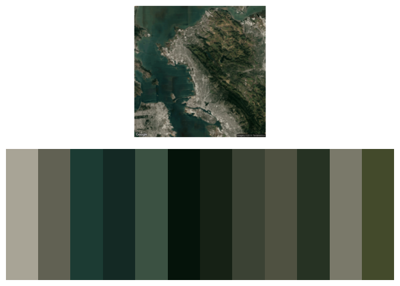
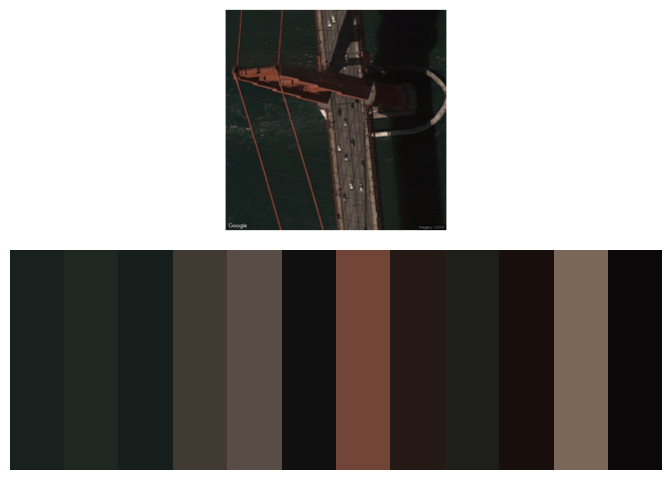
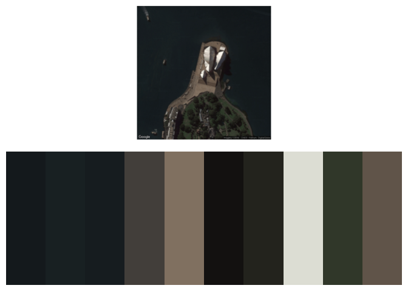

<!-- README.md is generated from README.Rmd. Please edit that file -->
[](http://www.repostatus.org/#active) [](https://travis-ci.org/wcornwell/earthtones) [](https://codecov.io/gh/wcornwell/earthtones)

------------------------------------------------------------------------

[](https://cran.r-project.org/) [](https://cran.r-project.org/package=earthtones) [](http://www.r-pkg.org/pkg/earthtones)

[](commits/master)

------------------------------------------------------------------------

[](/commits/master)


Here is how to install and load the R package:

``` r
install.packages("earthtones")
library("earthtones")
```
**NOTE: Due to changes in the Google Maps API, it's a bit harder to get the ggmap package (on which earthtones depends) working.  See the [github page for ggmap](https://github.com/dkahle/ggmap) for more information and instructions.**  

Find the color palette of particular parts of the world
-------------------------------------------------------

This package does the following:

1.  Downloads a image of a particular place from google earth/maps. Google uses a variety of sources for these images depending on the place and zoom
2.  Translates the colors into a perceptually uniform color space--CIE LAB
3.  Runs a clustering method (currently supporting choice of two different methods)
4.  Returns a color palette

There is only one function `get_earthtones`. Here is how you use it, in this case for the grand canyon:

``` r
get_earthtones(latitude = 36.094994, longitude=-111.837962, 
               zoom=12, number_of_colors=8)
```


`number_of_colors` corresponds to how many colors you want back. The `zoom` value is passed to `ggmap::get_map`--essentially larger values zoom closer to the target lat+long.

Maybe desert colors aren't your thing: you want a color scheme drawn from tropical reefs and lagoons. How about the Bahamas?

``` r
get_earthtones(latitude = 24.2, longitude=-77.88, zoom=11, number_of_colors=5)
```


Just pick your favorite place in the world, and find out the major colors

Here is San Francisco:

``` r
get_earthtones(latitude = 37.89, longitude=-122.28, zoom=11, number_of_colors=12)
```



or the Golden Gate Bridge:

``` r
get_earthtones(latitude = 37.81391, longitude=-122.478289, zoom=19, number_of_colors=12)
```



or Sydney Opera House :

``` r
get_earthtones(latitude = -33.85745, longitude=151.214722, zoom=17, number_of_colors=10)
```



If you want to actually use the color scheme for another visualization and not just plot pretty pictures, there is a switch in the `get_earthtones` function: just add `include.map=FALSE` to the function call, and the function will only return the color palette for later use:

``` r
if(!require(ggplot2)) install.packages("ggplot2")
bahamas_colors <- get_earthtones(latitude = 24.2,
      longitude=-77.88, zoom=11, number_of_colors=3,include.map=FALSE)
ggplot(iris, aes(x=Petal.Length, y=Petal.Width, col=Species))+
  geom_point(size = 2.5)+
  scale_color_manual(values = bahamas_colors)+
  theme_bw()
```


And now Fisher's irises are colored Bahamas-style. However, data from two of the three iris species was actually collected by a botanist named Edgar Anderson from the [Gaspé Peninsula in Quebec](https://www.jstor.org/stable/2394164?seq=1#page_scan_tab_contents), so it might be better to use a color scheme from there for those two species.

``` r
iris.from.gaspe <- subset(iris, iris$Species!="virginica")

get_earthtones(latitude = 48.7709,
  longitude=-64.660939,zoom=9,number_of_colors = 2)
```


``` r
gaspe <- get_earthtones(latitude = 48.7709,
  longitude=-64.660939 ,zoom=9, number_of_colors = 2,include.map=FALSE)
ggplot(iris.from.gaspe, aes(x=Petal.Length, y=Petal.Width,col=Species))+
  geom_point(size = 2.5)+
  scale_color_manual(values = gaspe)+
  theme_bw()
```


Some notes on clustering methods
--------------------------------

There are lots of ways to do the clustering in general and also in this particular case. The default is pam algorithm (for reasons explained below) but there is also k-means, which is a classic clustering method and is a bit simpler and faster.

Here is the k-means result for the bahamas:

``` r
get_earthtones(latitude = 24.2, longitude=-77.88,
               zoom=11, number_of_colors=5, method="kmeans")
```


and here is the pam one

``` r
get_earthtones(latitude = 24.2, longitude=-77.88, 
               zoom=11, number_of_colors=5, method="pam")
```


The sand-color is perhaps a bit sandier with the PAM approach. This actually makes sense because the PAM method returns medoids rather than centroids so the outputs are guaranteed to be actual colors in the image. When using the k-means method, the centroid of a set of colors may actually be a color that is not itself present in the image.

Inspiration
-----------

There are some other cool things to do with the cool and images in the [RImagePallette package](https://github.com/joelcarlson/RImagePalette). And there is a very cool blog on [the colors of Antarctica](https://havecamerawilltravel.com/colors-antarctica/). And of course if you want a quirky cinematic color scheme, check out [wesanderson](https://github.com/karthik/wesanderson).

Development version
-------------------

If you'd like to try the most recent development version of `earthtones` run this:

``` r
if(!require(devtools)) install.packages("devtools")
devtools::install_github("wcornwell/earthtones")
```
